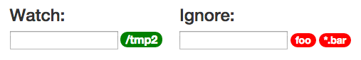

# FileSnitcher

A file-system monitoring app building on mbabauer's pub/sub <a href="https://github.com/mbabauer/meteor_publicationsDemo">demo</a> and <a href="https://github.com/paulmillr/chokidar">chokidar's</a> file wrapper.

File Snitcher records when files are added, changed, or deleted, as well as the users logged into the system at the time (*nix/OSX supported). Newly created files/directories display as green, changed as yellow, deleted as red, and those re-created (deleted then re-added and/or changed) as lightblue. Multiple ignore patterns can be configured.<br>


Also, whereas the browser app will only show changes since you loaded the page, the server additionally persists all changes from the time the meteor app started to a file in your home directory ~/snitcher.log. Files/dirs existing at the time of startup are not considered adds. The space-delimited format is [A/C/D (Add/Change/Delete)] [timestamp] [path] [logged-in user(s)].

```
  A Thu Jul 09 2015 14:24:50 GMT-0400 (EDT) /tmp2/foo (esoyke)
  C Thu Jul 09 2015 14:24:55 GMT-0400 (EDT) /tmp2/foo (esoyke)
  D Thu Jul 09 2015 14:25:04 GMT-0400 (EDT) /tmp2/foo (esoyke)
  A Thu Jul 09 2015 14:25:26 GMT-0400 (EDT) /tmp2/subdir/subdir2/foo (esoyke)
```
<a name="usage"></a>
## Usage
Clone repo, fire up meteor and browse to localhost:3000. That's it.

The app initializes to watch folder '/tmp2'. To change this enter the desired folder name (absolute path).

To ignore all files or subfolders named work and their contents, enter 'work'. Wildcards are supported: to ignore all file(s) and subfolders beginning with 'wor', enter 'wor*'. To ignore all files ending in txt enter '*.txt'.

To remove an ignore pattern, click on it's badge.<br>


## TODO:
* ~~Persist history, regardless of there being a client or not~~
* ~~Make watch directory configurable from client~~
* ~~Allow specification of excluded sub-directories~~
* Switch user listing to tooltips

## Issues:
* Re-created files (file deleted then created) only reflecting change after a SECOND touch. Still investigating.
* Might not display multiple logged-in users correctly (just saying this as this condition is yet to be tested on a multi-user server).
* File changes made when there is no active client session are cached until a client is created (the log). Also only Adds are recorded in these cases.
